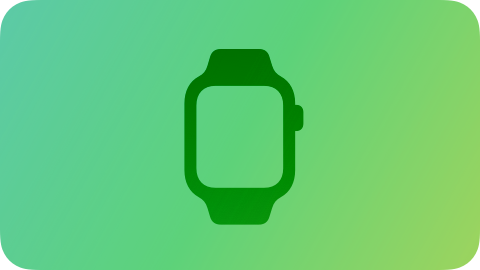

# Platforms
Create an app or game that feels at home on every platform you support.

<table class="platform_table">
<tr class="platform_table"> 
<td class="platform_table">
<b> iOS </b></td>
<td class="platform_table">
<b>iPadOS</b></td>
<td> 
<b>macOS</b></td>
</tr>
<tr class="platform_table"> 
<td class="platform_table">
<b>tvOS</b></td>
<td class="platform_table">
<b>watchOS</b></td>
</tr>
</table>

## Overview

To design for each platform we should know how people look at and interact with that.

| Platform	| Overview     		|
|------------	|------------|
| iOS 			|People depend on their iPhone to help them stay connected, play games, view media, accomplish tasks, and track personal data in any location and while on the go.							|
|iPadOS		|People value the power, mobility, and flexibility of iPad as they enjoy media, play games, perform detailed productivity tasks, and bring their creations to life.|
|macOS			|People rely on the power, spaciousness, and flexibility of a Mac as they perform in-depth productivity tasks, view media or content, and play games, often using several apps at once.|
|tvOS			|People enjoy the vibrant content, immersive experiences, and streamlined interactions that tvOS delivers in media and games, as well as in fitness, education, and home utility apps.|
|watchOS		|When people glance at their Apple Watch, they know they can access essential information and perform simple, timely tasks whether they’re stationary or in motion.|

## Display

Display is one of the most important contexts which user should cross to access to app's content. So, we should have a deep undrestanding about display of each platform.

| Platform	| Display     		|
|------------	|------------|
| iOS|	iPhone has a **medium-sized**, **high-resolution** display. |
| iPadOS |	iPad has a **large**, **high-resolution** display. |
| macOS	|	A Mac typically has a **large**, **high-resolution** display, and people can extend their workspace by connecting **additional displays**, including their iPad.|
| tvOS	|	A TV typically has a **very large**, **high-resolution** display.|
| watchOS	|	The **small** Apple Watch display **fits on the wrist** while delivering an easy-to-read, **high-resolution** experience.|

## Ergonomics

Ergonomics is about how people use their devices.

| Platform	| Ergonomics     	|
|------------	|------------|
| iOS|	People **generally hold their iPhone in one or both hands** as they interact with it, **switching between landscape and portrait** orientations as needed. While people are interacting with the device, their viewing distance tends to be **no more than a foot or two**.|
| iPadOS |	People **often hold their iPad while using it**, but they might also **set it on a surface** or **place it on a stand**. Positioning the device in different ways **can change the viewing distance**, although people are **typically within about 3 feet of the device** as they interact with it.
| macOS	|People **generally use a Mac while they’re stationary**, often placing the device **on a desk or table**. In the typical use case, the **viewing distance can range from about 1 to 3 feet.**|
| tvOS	|	Although people **generally remain many feet away from their stationary TV — often 8 feet or more** — they sometimes **continue to interact with content as they move around the room.**|
| watchOS|	Because **people wear Apple Watch**, they’re **usually no more than a foot away from the display** as they **raise their wrist to view it and use their opposite hand to interact with the device.** In addition, the **Always On display lets people view information on the watch face when they drop their wrist.**|	
> **Note**: A foot is about 30.5 cm

## Inputs

| Platform	|    Inputs 		|
|------------	|------------|
| iOS|[Multi-Touch gestures](), [onscreen keyboards](), and [voice]() control let people perform actions and accomplish meaningful tasks while they’re on the go. In addition, people often want apps to use their [location]() and input from the device’s [accelerometer and gyroscope](), and they may also want to participate in [spatial interactions]().	|
| iPadOS |	People can interact with iPad using [Multi-Touch gestures]() and [onscreen keyboards](), an attached [keyboard]() or [pointing device](), [Apple Pencil](), or [voice](), and they often combine multiple input modes.|
| macOS	|	 People expect to enter data and control the interface using any combination of input modes, such as physical [keyboards](), [pointing devices](), [game controllers](), and [voice]().	|
| tvOS	|	People can use a [remote](), a [game controller](), their [voice](), and apps running on their other devices to interact with Apple TV.|
| watchOS|	Using standard [Multi-Touch gestures]() like tap, swipe, and drag lets people control their experience even while they’re in motion. Turning the [Digital Crown]() imparts additional precision and feedback to scrolling interfaces, pressing the [Action button]() initiates an essential action without looking at the screen, and using [Siri Shortcuts]() can help people perform their routine tasks quickly and easily. People also appreciate taking advantage of data that device features — like GPS, sensors for blood oxygen and heart function, altimeter, accelerometer, and gyroscope — can provide.	|	

| Platform	|     		|
|------------	|------------|
| iOS|	|
| iPadOS |		|
| macOS	|		|
| tvOS	|		|
| watchOS|		|	
